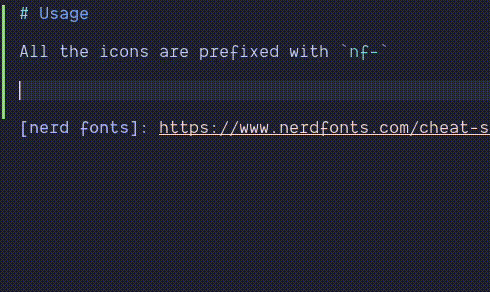

# cmp-nerdfonts

nvim-cmp source for [nerd fonts] icons.

# Setup

```lua
require'cmp'.setup {
  sources = {
    { name = 'nerdfonts' }
  }
}
```

# Usage

All the icons are prefixed with `nf-`



[nerd fonts]: https://www.nerdfonts.com/cheat-sheet
